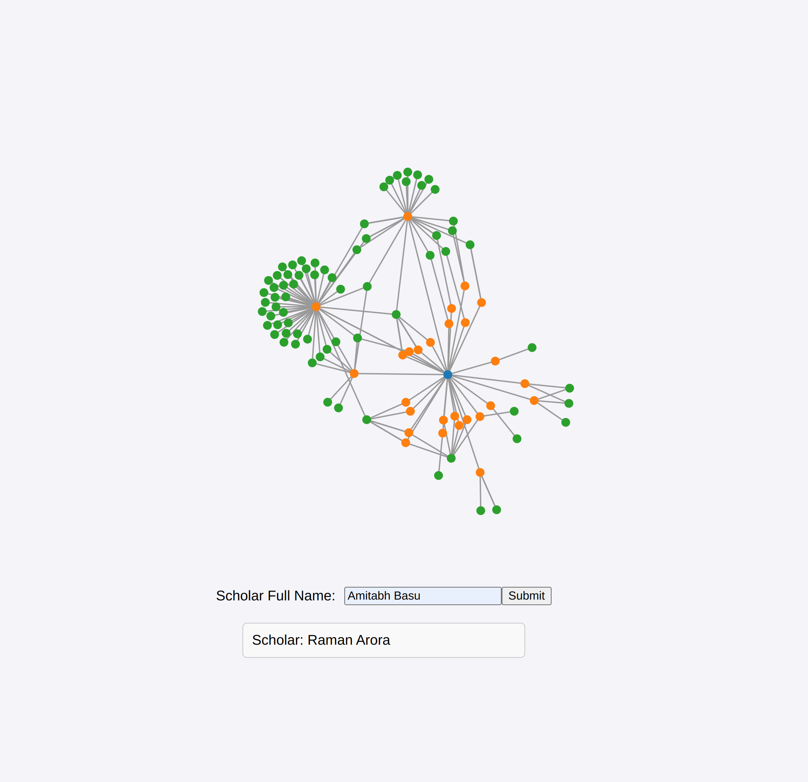

# ScholarNet
This is a project for the course Software Engineering for Data Science. It visualizes the graph structure of scholar collaborations. The data is scraped by querying the arXiv, extract the name of the collaborators and their affiliations(Universities and Departments). By entering the name of a scholar, you have an intuitive access to the network info. 

# Why do you need this
The first usage that comes to my mind is in assisting the process of graduate program applications. It tells you where your recommender's letter will be more recognized, thus increasing your chance of admission. 

# How does it work
In backend/affiliation/, you should get the graph generator running with
```
python graph_generator.py
```

Then, direct to frontend/, and run 
```
python3 -m http-server
```

It should direct you to a local host page like below. 


After that, enter the name of scholar(notice: not all scholars can be queried, it's limited by the graph structure which can be scaled), for example Amitabh Basu, who I greatly appreciate for agreeing to be one of my recommenders for my PhD application, and click submit button. You should see something similar to the following:


Notice that you can drag the nodes around and click it to get the information for the name of the scholar/institution. Here, blue dot represents the scholar you queried, yellow dots are the institutions like Johns Hopkins University, and the green ones are collaborators. 

# How is it done
In the frontend, the visualization was done by d3. The rest are mostly done in the backend/preprocessing. It is capable of querying current scholars using arXiv url API, download their collaboration papers, process their first pages to extract affiliation info using OpenAI API, and then recursively querying the new scholars recognized in the process of processing collaborators. In other words, I can scrap the entire arXiv if 

1. It allows unlimited number of queries
2. The collaboration graph is connected
3. My CPU is amazing
4. Gigantic hard drive(s)
5. Free OpenAI API call

Unfortunately, most of them are unfeasible due to limited(no) funding. But still, this baby is fun to play with. 

# Limitations
Well, these are direct results from the lack of funding mentioned in the previous part. I can't query the entire arXiv so I might(probably) miss some(a lot) papers. This means some of the institutions with strong connection with your recommender might not appear. The better the graph I scrapped, the better and more accurate the result would be.

# What can be done
I can certainly get the embeddings of papers and assign them back to the authors. This will result in a database of paper embeddings and scholar embedding(by pooling from his/her papers' embeddings). In other words, right now given any paper or scholar, I can hint you with papers or scholars you might be interested in. 

And, of course, by scraping the latest papers in the area of your choice, it can generate a summary of what is currently going on.

# Some Advice for YOU
Don't hit the "Accept all Cookies" button.

If you can, read the terms and be aware of what kinds of info you are sharing with third parties.

This is what I can do from a fully public dataset, imagine what they can do with the sensitive ones.

